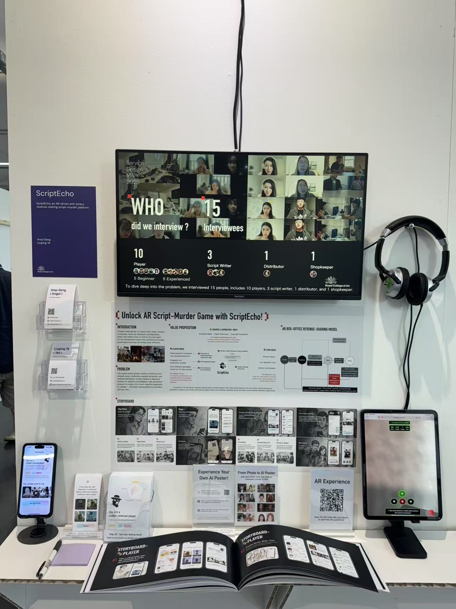

# 🎮 ScriptEcho AR Racing Game - Exhibition Version

## About ScriptEcho

**ScriptEcho** is an AR-driven, revenue-sharing script-murder platform that offers AR production and anti-piracy revenue sharing for publishers, creators, and venues; while giving players smart role matching, seamless group formation, and immersive detective experiences.

This AR Racing Game serves as a technology demonstration of ScriptEcho's AR capabilities, showcasing real-time AR content rendering, environmental plane detection, and interactive game mechanics - core technologies that power the ScriptEcho platform's immersive experiences.

## 🚗 AR Racing Game

An advanced AR racing game originally built with AR Foundation and now featuring multiple platform support including Unity ARDK, AR Foundation, and a web-based AR.js version for maximum accessibility across devices and exhibitions.

### 🌟 Exhibition Showcase

**ScriptEcho AR Racing** successfully demonstrated at technology exhibitions, showcasing real AR capabilities with environmental plane detection and immersive gameplay:

| Exhibition Experience | Interactive Gameplay | Technology Demo |
|---|---|---|
|  |  |  |

| Professional Setup | Live Demonstration |
|---|---|
|  |  |

*Visitors experiencing true AR functionality with real-world plane detection and virtual content anchoring*

### 🌟 Exhibition Features

This project includes a special **Exhibition Web Version** (`ar-racing-arjs-iphone.html`) designed for trade shows and public demonstrations:

- **Real-time Environmental Scanning**: Advanced plane detection that anchors virtual content to real-world surfaces
- **Cross-Platform Compatibility**: Works on iOS, Android, and web browsers without app installation
- **Interactive AR Experience**: Players control vehicles in true AR space with realistic perspective changes
- **Professional Exhibition UI**: Optimized for public demonstrations with clear instructions and engaging visuals

### 📱 Platform Support

1. **Unity with Lightship ARDK** (`MainGameAR_ARDK.unity`)
   - Advanced AR features with Niantic's ARDK
   - Real-world mesh scanning and occlusion
   - Multiplayer AR experiences

2. **Unity with AR Foundation** (`MainGameAR_Foundation.unity`)
   - Cross-platform AR support (iOS/Android)
   - Plane detection and anchor management
   - Optimized for mobile devices

3. **Web AR.js Version** (`ar-racing-arjs-iphone.html`)
   - Browser-based AR without app installation
   - Instant access for exhibitions and demos
   - WebGL-based 3D rendering with AR.js

4. **Standalone Testing** (`MainGameAR_Standalone.unity`)
   - Physics testing and development
   - No AR dependencies for rapid iteration

### 🎮 Game Features

- **Environmental Scanning**: Real-time detection and mapping of horizontal surfaces
- **Vehicle Selection**: Choose between racing car and flying airplane modes
- **Smart Object Placement**: Game objects positioned on detected real-world planes
- **Immersive Controls**: Touch-based movement controls optimized for AR interaction
- **Scoring System**: Points, combos, and time-based challenges
- **Visual Effects**: Particle systems and smooth animations
- **Audio Feedback**: Procedural sound generation for enhanced immersion

### 🛠️ Development Setup

#### Unity Version Requirements
- Unity 2021.3 LTS or newer
- AR Foundation 4.2+
- Lightship ARDK 2.0+ (for ARDK scenes)

#### Web Version Setup
1. Host the `ar-racing-arjs-iphone.html` file on an HTTPS server
2. Access via mobile browser with camera permissions
3. No additional setup required - pure web technologies

### 🎯 Missions & Customization

A scriptable object system is included under `/Assets/Scriptables/Missions` to create custom racing challenges and game modes.

📺 **Watch the complete development process**: [YouTube AR Racing Game Video Series](https://www.youtube.com/watch?v=k2bpIXzwcWA&list=PLQMQNmwN3FvzKF1Yycc1WtpHrooTLPjDR)

### 🚀 Quick Start Guide

#### For Unity Development:
1. Clone this repository
2. Open in Unity 2021.3 LTS+
3. Install required AR packages via Package Manager
4. Open desired scene (ARDK or AR Foundation)
5. Build and deploy to AR-capable device

#### For Web Exhibition:
1. Upload `ar-racing-arjs-iphone.html` to HTTPS server
2. Share URL with exhibition visitors
3. Visitors scan QR code or access URL directly
4. Start AR experience instantly in browser

### 📋 Exhibition Deployment

This project includes several deployment scripts for easy exhibition setup:

- `deploy-exhibition.sh` - Complete exhibition deployment
- `setup-https.sh` - HTTPS server configuration  
- `deploy-arjs-version.sh` - Web AR version deployment

### 🏆 Features Showcase

- ✅ **Real AR Plane Detection**: Content anchored to physical surfaces
- ✅ **Multi-Platform Support**: Unity + Web versions
- ✅ **Exhibition Ready**: Professional UI and user experience
- ✅ **No Installation Required**: Web version works instantly
- ✅ **Scalable Architecture**: Easy to customize and extend
- ✅ **Performance Optimized**: Smooth 60fps AR rendering
- ✅ **Live Demonstration**: Successfully showcased at technology exhibitions

### 📞 About the Technology

This AR Racing Game demonstrates core technologies used in the ScriptEcho platform:
- Real-time AR content rendering and tracking
- Environmental understanding and plane detection
- Interactive 3D object manipulation in AR space
- Cross-platform compatibility and deployment
- User engagement and gamification in AR experiences

---

**ScriptEcho** - Revolutionizing interactive entertainment through augmented reality technology.

For more information about ScriptEcho platform and AR development services, visit our exhibition booth or contact our development team.